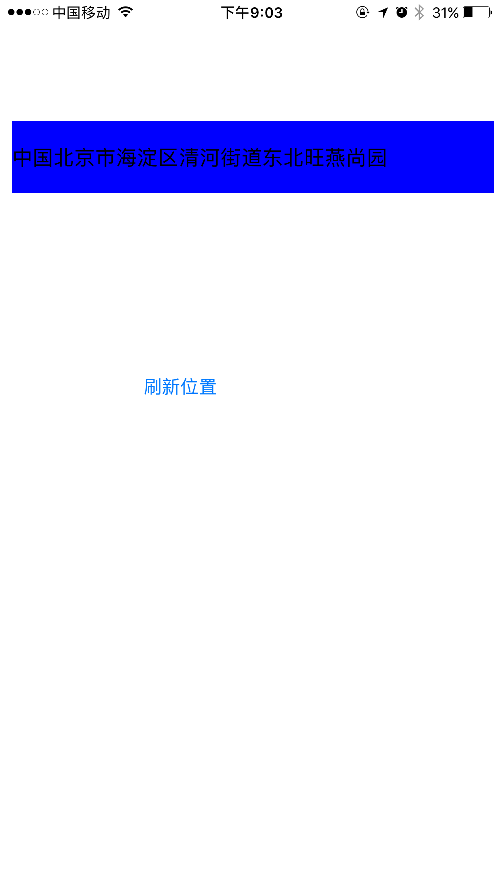

在手机上获取的地理位置信息分为两类：
- 当前位置的经纬度信息
- 当前位置根据经纬度逆编码后的地理名称

### 一、概述
通过CoreLocation.framework（以下简称CL），会使用GPS、基站、wifi方式、蓝牙、磁力计、气压计获取当前地理位置、方位、海拔。由于CoreLocation是系统的定位框架，所以通过获取的经纬度进行逆编码后的地理名称的准确度还是很高的。

现在很多团购软件，对用户的位置具有强依赖性，像美团、美团外卖、饿了么、百度外卖等，需要根据所处位置推荐商家和推送信息。那么位置的准确性就非常影响用户的体验了，现在市面上主流的地图：百度地图、高德地图、腾讯地图都具有逆编码的能力，集成SDK后对手机采集的经纬度信息进行处理就能得到地理名称。
如下图：



### 二、框架概述

- [CLLocationManager
](https://developer.apple.com/documentation/corelocation/cllocationmanager?language=objc) ：用来启动或停止定位服务

````
//常用方法

//判断定位服务是否开启
+ (BOOL)locationServicesEnabled __OSX_AVAILABLE_STARTING(__MAC_10_7,__IPHONE_4_0);
//获取定位服务授权状态
+ (CLAuthorizationStatus)authorizationStatus __OSX_AVAILABLE_STARTING(__MAC_10_7,__IPHONE_4_2);

//请求使用时位置授权 每次定位前需要调用
- (void)requestWhenInUseAuthorization __OSX_AVAILABLE_STARTING(__MAC_NA, __IPHONE_8_0);
//请求始终使用位置授权 每次定位前需要调用
- (void)requestAlwaysAuthorization __OSX_AVAILABLE_STARTING(__MAC_NA, __IPHONE_8_0) __TVOS_PROHIBITED;
//开启位置更新，CLLocationManager通过代理将位置异步传给代理对象
- (void)startUpdatingLocation __TVOS_PROHIBITED;
//停止位置更新
- (void)stopUpdatingLocation;
//请求一次位置更新
- (void)requestLocation __OSX_AVAILABLE_STARTING(__MAC_NA, __IPHONE_9_0);

//常用属性

//最小更新位置的间隔距离
@property(assign, nonatomic) CLLocationDistance distanceFilter;
//定位精度
@property(assign, nonatomic) CLLocationAccuracy desiredAccuracy;
//允许后台位置更新
@property(assign, nonatomic) BOOL allowsBackgroundLocationUpdates __OSX_AVAILABLE_STARTING(__MAC_NA,__IPHONE_9_0) __TVOS_PROHIBITED __WATCHOS_PROHIBITED;
//最新接收到的位置
@property(readonly, nonatomic, copy, nullable) CLLocation *location;
````

- CLLocationManagerDelegate : CLLocationManager的代理

````
//位置产生更新，从旧位置变到新位置
- (void)locationManager:(CLLocationManager *)manager
	didUpdateToLocation:(CLLocation *)newLocation
		   fromLocation:(CLLocation *)oldLocation __OSX_AVAILABLE_BUT_DEPRECATED(__MAC_10_6, __MAC_NA, __IPHONE_2_0, __IPHONE_6_0) __TVOS_PROHIBITED __WATCHOS_PROHIBITED;
//位置产生更新
- (void)locationManager:(CLLocationManager *)manager
	 didUpdateLocations:(NSArray<CLLocation *> *)locations __OSX_AVAILABLE_STARTING(__MAC_10_9,__IPHONE_6_0);
//CLLocationManager产生错误
- (void)locationManager:(CLLocationManager *)manager
	didFailWithError:(NSError *)error;
````

- CLLocation : 位置对象，由CLLocationManager产生

````
//CLLocation中包含位置的经度和纬度
struct CLLocationCoordinate2D {
	CLLocationDegrees latitude;
	CLLocationDegrees longitude;
};
typedef struct CLLocationCoordinate2D CLLocationCoordinate2D;
//代表位置的定位精度
typedef double CLLocationDistance;
//各类经度
extern const CLLocationAccuracy kCLLocationAccuracyBestForNavigation __OSX_AVAILABLE_STARTING(__MAC_10_7,__IPHONE_4_0);
extern const CLLocationAccuracy kCLLocationAccuracyBest;
extern const CLLocationAccuracy kCLLocationAccuracyNearestTenMeters;
extern const CLLocationAccuracy kCLLocationAccuracyHundredMeters;
extern const CLLocationAccuracy kCLLocationAccuracyKilometer;
extern const CLLocationAccuracy kCLLocationAccuracyThreeKilometers;
//海拔
@property(readonly, nonatomic) CLLocationDistance altitude;
//水平精度
@property(readonly, nonatomic) CLLocationAccuracy horizontalAccuracy;
//垂直精度
@property(readonly, nonatomic) CLLocationAccuracy verticalAccuracy;
//速度
@property(readonly, nonatomic) CLLocationSpeed speed __OSX_AVAILABLE_STARTING(__MAC_10_7,__IPHONE_2_2) __TVOS_PROHIBITED;
//时间戳
@property(readonly, nonatomic, copy) NSDate *timestamp;

//通过给定的经纬度初始化一个CLLocation对象
- (instancetype)initWithLatitude:(CLLocationDegrees)latitude
	longitude:(CLLocationDegrees)longitude;
//通过经纬度、水平精度、垂直精度、时间戳初始化一个CLLocation对象
- (instancetype)initWithCoordinate:(CLLocationCoordinate2D)coordinate
	altitude:(CLLocationDistance)altitude
	horizontalAccuracy:(CLLocationAccuracy)hAccuracy
	verticalAccuracy:(CLLocationAccuracy)vAccuracy
	timestamp:(NSDate *)timestamp;
//通过经纬度、水平精度、垂直精度、速度、时间戳初始化一个CLLocation对象
- (instancetype)initWithCoordinate:(CLLocationCoordinate2D)coordinate
    altitude:(CLLocationDistance)altitude
    horizontalAccuracy:(CLLocationAccuracy)hAccuracy
    verticalAccuracy:(CLLocationAccuracy)vAccuracy
    course:(CLLocationDirection)course
    speed:(CLLocationSpeed)speed
    timestamp:(NSDate *)timestamp __OSX_AVAILABLE_STARTING(__MAC_10_7,__IPHONE_4_2);
//返回两个位置间的间距
- (CLLocationDistance)distanceFromLocation:(const CLLocation *)location __OSX_AVAILABLE_STARTING(__MAC_10_6,__IPHONE_3_2);
````

- CLError : 定位所产生的错误对象

````
typedef NS_ENUM(NSInteger, CLError) {
    kCLErrorLocationUnknown  = 0,         // 位置错误类型，但是CL框架会尝试定位
    kCLErrorDenied,                       // 用户拒绝定位权限
    kCLErrorNetwork,                      // 网络错误
    kCLErrorHeadingFailure,               // heading 没有被决定
    kCLErrorRegionMonitoringDenied,       // 用户拒绝位置监视
    kCLErrorRegionMonitoringFailure,      // 无法监视注册的区域
    kCLErrorRegionMonitoringSetupDelayed, // CL无法立刻初始化区域监视器
    kCLErrorRegionMonitoringResponseDelayed, // 地理围栏将会被传递，但不会立刻出现
    kCLErrorGeocodeFoundNoResult,         // A geocode request yielded no result
    kCLErrorGeocodeFoundPartialResult,    // A geocode request yielded a partial result
    kCLErrorGeocodeCanceled,              // A geocode request was cancelled
    kCLErrorDeferredFailed,               // Deferred mode failed
    kCLErrorDeferredNotUpdatingLocation,  // Deferred mode failed because location updates disabled or paused
    kCLErrorDeferredAccuracyTooLow,       // Deferred mode not supported for the requested accuracy
    kCLErrorDeferredDistanceFiltered,     // Deferred mode does not support distance filters
    kCLErrorDeferredCanceled,             // Deferred mode request canceled a previous request
	kCLErrorRangingUnavailable,           // Ranging cannot be performed
	kCLErrorRangingFailure,               // General ranging failure
};
````

### 三、使用CL的定位步骤
1. 请求定位服务权限
    - 使用[authorizationStatus
](https://developer.apple.com/documentation/corelocation/cllocationmanager/1423523-authorizationstatus?language=objc)的类方法来判断是否得到了用户的授权
    - 如果授权状态是[kCLAuthorizationStatusRestricted
](https://developer.apple.com/documentation/corelocation/clauthorizationstatus/kclauthorizationstatusrestricted?language=objc) 或 [kCLAuthorizationStatusDenied
](https://developer.apple.com/documentation/corelocation/clauthorizationstatus/kclauthorizationstatusdenied?language=objc)代表应用没有权限使用定位，应当立即终止使用定位服务
    - 如果授权状态是[kCLAuthorizationStatusNotDetermined
](https://developer.apple.com/documentation/corelocation/clauthorizationstatus/kclauthorizationstatusnotdetermined?language=objc)代表应用还未得到明确的授权，需要调用 [requestWhenInUseAuthorization
](https://developer.apple.com/documentation/corelocation/cllocationmanager/1620562-requestwheninuseauthorization?language=objc) 或 [requestAlwaysAuthorization
](https://developer.apple.com/documentation/corelocation/cllocationmanager/1620551-requestalwaysauthorization?language=objc) 方法来向用户申请授权
2. 判断定位服务是否可用
    - 调用[CLLocationManager ](https://developer.apple.com/documentation/corelocation/cllocationmanager?language=objc)对象的 + (BOOL)locationServicesEnabled 方法获取定位服务是否可以使用。
3. 初始化CLLocationManager对象
    - 对CLLocationManager对象进行强引用，以防被ARC释放，因为CLLocationManager对象进行定位时是异步的，所以，需要通过回调来接收定位后的结果
4. 实现 CLLocationManagerDelegate 代理

### 四、注意事项
- 在应用的Info.plist文件中加入NSLocationWhenInUseUsageDescription来解释使用位置服务的用途。
- 调用[requestWhenInUseAuthorization
](https://developer.apple.com/documentation/corelocation/cllocationmanager/1620562-requestwheninuseauthorization?language=objc) 或 [requestAlwaysAuthorization
](https://developer.apple.com/documentation/corelocation/cllocationmanager/1620551-requestalwaysauthorization?language=objc)方法来通知系统向用户请求授权。（在初次使用时会弹出，用户拒绝后只能去设置中手动开启）
> #### Tip
如果忘记以上两步，会导致授权请求立刻失效，应用无法使用定位服务。
-  [requestWhenInUseAuthorization](https://developer.apple.com/documentation/corelocation/cllocationmanager/1620562-requestwheninuseauthorization?language=objc)是在应用使用期间授权，应用进入后台后不再能使用定位服务。
-  [requestAlwaysAuthorization ](https://developer.apple.com/documentation/corelocation/cllocationmanager/1620551-requestalwaysauthorization?language=objc)是始终使用定位服务，无论应用在前台还是在后台。
- 以上两种权限可以都写在Info.plist文件中，系统会默认是使用期间授权。

### 五、代码实现
调用HFLocation的getLocationName:方法，就会通过回调返回一个手机所处的位置逆解码地理位置。
````
//
//  HFLocation.h
//  HFLocation
//
//  Created by whf on 17/6/25.
//  Copyright © 2017年 apple. All rights reserved.
//

#import <Foundation/Foundation.h>

@interface HFLocation : NSObject

- (instancetype)sharedInstance;
- (void)getLocationName:(void(^) (NSError *error,NSDictionary *result))block;

@end

````

````
//
//  HFLocation.m
//  HFLocation
//
//  Created by whf on 17/6/25.
//  Copyright © 2017年 apple. All rights reserved.
//

#import "HFLocation.h"
#import <CoreLocation/CoreLocation.h>

@interface HFLocation() <CLLocationManagerDelegate>

@property (nonatomic, strong) CLLocationManager *locationMgr;
@property (nonatomic, copy) void (^block) (NSError *error,NSDictionary *result);

@end

@implementation HFLocation

- (instancetype)sharedInstance {
    static HFLocation *location = nil;
    static dispatch_once_t onceToken;
    dispatch_once(&onceToken, ^{
        location = [[HFLocation alloc] init];
    });
    return location;
}

- (instancetype)init {
    if (self = [super init]) {
        CLLocationManager *locationMgr = [[CLLocationManager alloc] init];
        self.locationMgr = locationMgr;
        [locationMgr requestWhenInUseAuthorization];
        locationMgr.desiredAccuracy = kCLLocationAccuracyBest;
        locationMgr.distanceFilter = 10.0;
        locationMgr.delegate = self;
    }
    return self;
}

- (void)dealloc {
    NSLog(@"%@ -dealloc",NSStringFromClass([self class]));
}

- (void)getLocationName:(void (^)(NSError *, NSDictionary *))block {
    if ([CLLocationManager locationServicesEnabled]) {//定位服务开启
        [self.locationMgr startUpdatingLocation];
        self.block = block;
    }
}

#pragma mark - CLLocationManagerDelegate
- (void)locationManager:(CLLocationManager *)manager
     didUpdateLocations:(NSArray<CLLocation *> *)locations{
    if (locations) {
        CLLocation *location = [locations firstObject];
        CLGeocoder *geocoder = [[CLGeocoder alloc] init];
        __weak typeof(self) weak_self = self;
        [geocoder reverseGeocodeLocation:location completionHandler:^(NSArray<CLPlacemark *> * _Nullable placemarks, NSError * _Nullable error) {
            __strong typeof(weak_self) self = weak_self;
            if (error) {
                NSLog(@"%@",error);
                if (self.block) {
                    self.block(error,nil);
                }
            }
            else {
                CLPlacemark *placemark = [placemarks firstObject];
                self.block(nil,placemark.addressDictionary);
            }
        }];
        [self.locationMgr stopUpdatingLocation];
    }
}

- (void)locationManager:(CLLocationManager *)manager
       didFailWithError:(NSError *)error {
    NSLog(@"%@",error);
}
@end

````